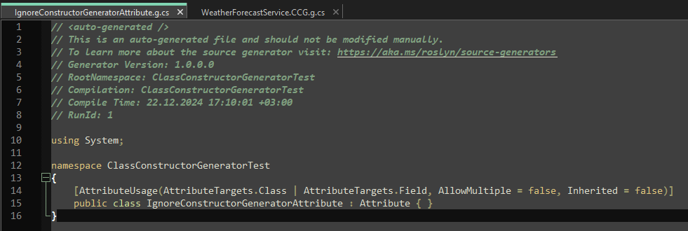
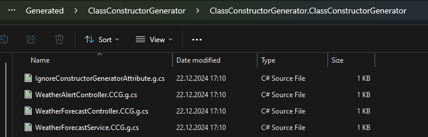
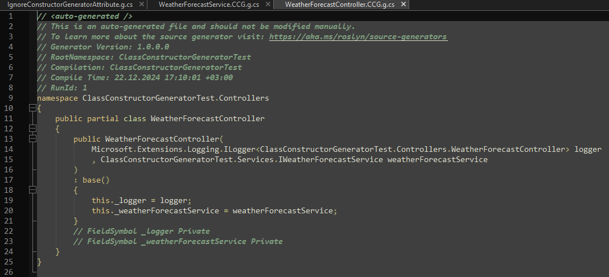

# .NET ile Statik Kod Üretiminin Gücü

Statik kaynak kod (Static Code Generation) üretimi, yazılım geliştirme sürecinde otomasyonu artırmak ve manuel kod yazımını azaltmak için kullanılan etkili bir tekniktir. .NET ekosisteminde bu yöntem, özellikle tekrarlayan yapıların programatik olarak oluşturulması gerektiğinde oldukça faydalıdır. Bu makalede, bir örnek proje üzerinden .NET ile statik kaynak kod geliştirme süreçlerini inceleyeceğiz.

Ama önce biraz teori ile başlayalım.

## Kod Üretimi (Code Generation) Nedir?

Kod üretimi, bir yazılım geliştirme sürecinde, belirli kurallar veya tanımlara dayanarak kaynak kod oluşturma işlemidir. Yazılım geliştiricilerin manuel olarak yazması gereken kodları, daha kısa sürede ve hata riskini azaltarak üretmeyi sağlar.

## Kod Üretiminin Faydaları

- **Önemli olana odaklanma:** Hepimiz biliyoruz ki yazılım geliştirmenin bir kısmı (ki belli durumlarda büyük bir kısmı ) hammaliyedir. Aynı şeyleri tekrar tekrar yazmak gerektiğinde yardımımıza kod üretimi koşabilir. Böylece önemli olan kodlara odaklanmamızı sağlayabilir.
- **Zamandan Tasarruf:** Tekrarlayan kod yazma işlemini otomatikleştirerek veya bazı işlerle sizin uğraşmamanızı sağlayarak, geliştirme sürecini hızlandırır.
- **Hata Azaltma:** Şablon bazlı üretim sayesinde manuel hataları minimize eder.
- **Kod Tutarlılığı:** Tüm proje genelinde standartlaştırılmış ve uyumlu kod sağlar.
- **Kod Doğrulama:** Üretilen kodların, proje genelinde veya şirket genelinde konulmuş kurallara uymasını kontrol ettirebilirsiniz. Bu sayede kod kalitesini artırabilirsiniz. 

## Kod Üretiminin Çeşitleri

Kod üretimi, genellikle iki ana kategoriye ayrılır: statik ve dinamik kod üretimi. Her iki yöntemin de kendine özgü avantajları ve dezavantajları vardır. Proje gereksinimlerine ve performans ihtiyaçlarına bağlı olarak, bu yöntemlerden biri veya her ikisi birlikte kullanılabilir. 


### Statik Kod Üretimi

Statik kod üretimi, derleme sürecinde çalışan ve kaynak kod dosyalarını oluşturup projeye ekleyen bir yöntemdir. Bu yöntem, özellikle sabit veya şablona dayalı kodlar için kullanılır.

Bu yöntemi 2 farklı şekilde kullanabilirsiniz:

1. **Önceden Üretilmiş Kodlar:** Önceden belirlenmiş şablonlara göre kod üretir. Kodlar developer'ın yazdığı kodların yanında veya yakınında bir yerde dosya olarak oluşturulur. Derleme sırasında da bu dosyalar direk derlemeye dahil olurlar. Bu noktada çok istenmese de üretilmiş dosyalar üzerinde değişiklik yapma şansına sahip olabiliriz. Örnek olarak; WCF Servisleri, WebServisler gibi wsdl tabanlı servislerin client proxy sınıflarını ürettirdiğinizde projenizin içerisinde bu wsdl dosyalarındaki içerik için kodlar oluşturulacaktır. Bunları görebilir ve önerilmese de düzenleyebilirsiniz.
2. **Derleme Sırasında Üretilmiş Kodlar:** Bu yöntemde kodlar derleme sırasında derleyicinin içerisinde oluşturulur ve fiziksel olarak bir dosyaya yazılmadan derleme sürecine dahil edilir. Bu yöntemde üretilen kodların değiştirilmesi mümkün değildir.

**Artıları:**

- Kod tam olarak üretilir ve bir yöntemde düzenlenebilir.
- Derleme öncesi tüm kodlar hazırdır.
- Kodlar derleme ile çıktıya dahil edildiği için performanslıdır.
- Kodlar bu işlemler sırasında çeşitli özel kontrollerden geçirilebilir.

**Eksileri:**

- Kod şişkinliği yaratabilir.
- Bir yöntemde üretilen kodlar değiştirilemez(Derleme sırasında üretilen kodlar için).

### Dinamik Kod Üretimi

Dinamik kod üretimi, çalışma zamanında kod oluşturur ve çalıştırır. Örneğin, Reflection veya Expression Trees kullanılarak yapılır. Hatta .Net çalışma anında dinamik oluşturduğunuz kodları derlemenize ve dinamik dll dosyalarını hafızada hazırlamanıza olanak tanır. Bu sayede çalışma ortamı koşullarına göre kod üretimi yapılabilir. Özellikle çok değişken olabilen ortamlarda daha başarılı sonuçlar vermektedir.

**Artıları:**

- Çalışma anında kod üretimi yapıldığı için derlenen kod daha küçük olabilmektedir.
- Çalışma zamanında davranış değişikliklerine imkan tanır.

**Eksileri:**

- Her ne kadar kodlar derlense de statik kod üretimindeki gibi derleme anında olmadığı için performansı daha düşük olabilir.
- Derleme zamanı alınabilecek hatalar, derlemenin çalışma zamanına taşınması nedeniyle çalışma zamanına kaldığı için, hata ayıklama daha zordur.

## .NET ve Kod Üretimi

.NET platformu, hem statik hem de dinamik kod üretimi için çeşitli araç ve kütüphaneler sunar:

- **Roslyn API:** Statik kod üretimi için güçlü bir temel sağlar. Syntax analizi ve kod üretimi için kullanılabilir.
- **Reflection:** Çalışma zamanında dinamik kod üretimi ve çalışma sürecinde kod incelemesi yapar.
- **Expression Trees:** Dinamik kod üretiminin performanslı bir yoludur.

Bu farklı yöntemler, proje gereksinimlerine ve performans ihtiyaçlarına göre seçilebilir.

## .Net ve Statik Kod Üretimi

Statik kod üretimi, yazılım projelerinde manuel olarak yazılması gereken tekrarlayan kodları otomatikleştiren ve bu süreçte derleme aşamasında devreye giren bir tekniktir. Yazılımın şablonlarını veya yapılarını önceden tanımlanan kurallar çerçevesinde programatik olarak oluşturur. Bu, kodun daha sürdürülebilir, tutarlı ve bakımı kolay hale gelmesine yardımcı olur.

Roslyn API gibi araçlar, .NET ekosisteminde statik kod üretimi için güçlü bir temel sunar. Bu API, yazılım geliştiricilere kaynak kod analizi, yeni kod parçaları oluşturma ve mevcut kod üzerinde değişiklik yapma olanakları sağlar. Özellikle Roslyn’in sunduğu zengin syntax analizi ve jenerasyon yetenekleri, bu süreci kolaylaştırır.

Statik kod üretimi, farklı ölçeklerdeki projeler için avantajlar sunar. Örneğin, belirli bir tasarım desenine uyan sınıflar için constructor metotları, DTO nesneleri ya da servis tanımları otomatik olarak oluşturulabilir. Bu, manuel yazımı azaltarak zaman kazandırır ve hata riskini minimuma indirir. Ayrıca büyük kurumsal projelerde standartlaştırılmış kod tabanları oluşturulmasına olanak tanır.

Statik Kod üretimi için bazı kaynakları şöyle listeleyebiliriz:

1. [C# Source Generators](https://learn.microsoft.com/en-us/shows/on-dotnet/c-source-generators)
1. [Introducing Source Generators](https://devblogs.microsoft.com/dotnet/introducing-c-source-generators/?WT.mc_id=dotnet-00000-cephilli)
2. [Source Generators Cookbook](https://github.com/dotnet/roslyn/blob/main/docs/features/source-generators.cookbook.md)
3. [New C# Source Generator samples](https://devblogs.microsoft.com/dotnet/new-c-source-generator-samples/?WT.mc_id=dotnet-00000-cephilli)
4. [Source Generator Samples](https://learn.microsoft.com/en-us/dotnet/core/dotnet-five?WT.mc_id=dotnet-00000-cephilli)
4. [All About C# Source Generators | .NET Conf 2023](https://www.youtube.com/watch?v=Yf8t7GqA6zA)
4. [Source Generators in C#](https://code-maze.com/csharp-source-generators/)

## Static Code Generator Nasıl Çalışır?

Static Code Generator, yazılım projelerinde derleme süreci sırasında devreye girer ve hedeflenen kod parçalarını analiz ederek yeni kaynak kod dosyaları oluşturur. Bu süreç üç temel adımda gerçekleşir:

1. **Kod Analizi:** Static Code Generator, derleme sırasında mevcut kodları analiz eder. Bu analiz genellikle Roslyn Syntax API’si kullanılarak yapılır. Syntax ağacı üzerinden belirli desenler veya özniteliklere sahip sınıflar tespit edilir.

2. **Kod Üretimi:** Analiz sonucu belirlenen sınıflar veya yapılar için otomatik olarak kaynak kod dosyaları üretilir. Bu kodlar, genellikle proje içerisinde başka bir derleme aşamasında kullanılmak üzere hazırlanır.

3. **Kod Ekleme:** Üretilen kaynak kodlar, derleyiciye aktarılır ve projeye dahil edilir. Bu işlem, çalışma zamanını değil, derleme sürecini etkiler.

Bu adımların sonucunda, yazılımcının manuel olarak yazması gereken kod miktarı azalır ve kodda tutarlılık sağlanır. Static Code Generator, özellikle sık kullanılan tasarım desenleri veya standart yapılar için etkili bir çözüm sunar.

.NET platformunda Static Code Generator'lar, belirli görevleri yerine getirmek ve derleme sürecinde ek kodlar üretmek amacıyla kullanılabilir. Bu tür kod üreticileri oluşturmak için iki temel arayüz bulunmaktadır:

1. **`ISourceGenerator` Arayüzü:**<br/>
    Bu arayüz, kod üretimi sırasında derleyici ile doğrudan etkileşim kurmanıza olanak tanır. Derleme sürecinde analiz yaparak mevcut kodları inceleyebilir ve ihtiyaç duyulan ek kodları üretebilirsiniz. ISourceGenerator, daha basit kod üretimi ihtiyaçlarına yönelik olarak tasarlanmıştır ve işlemleri genellikle tek bir aşamada gerçekleştirir. Ancak, büyük ve karmaşık projelerde, optimize edilmesi gereken süreçlerde performans sınırlamaları olabileceği göz önünde bulundurulmalıdır.
2. **`IIncrementalGenerator` Arayüzü:**<br/>
    Daha büyük ve dinamik projelerde kullanılmak üzere tasarlanan bu arayüz, kod üretim sürecini parçalara böler ve daha verimli hale getirir. IIncrementalGenerator, kod üretimi sırasında yalnızca değişen veya güncellenmesi gereken parçaları yeniden işler, böylece gereksiz hesaplamaların önüne geçer. Incremental yaklaşım, özellikle büyük kod tabanlarında performansı artırmak ve daha hassas analizler yapmak için ideal bir çözüm sunar.

Her iki arayüz de farklı ihtiyaçlara hitap eder ve uygun olanı seçmek, projenin gereksinimlerine ve boyutuna bağlıdır. Örneğin, basit bir kod üretimi için ISourceGenerator tercih edilebilirken, daha karmaşık ve dinamik bir yapı için IIncrementalGenerator kullanılması önerilir.

## Örnek Proje: `ClassConstructorGenerator`

Bu makalede, bir sınıf oluşturucu (constructor) kodlarını otomatik olarak üreten bir Source Generator örneğini inceleyeceğiz. Projenin kaynak kodlarına [GitHub üzerinde](https://github.com/alperkonuralp/CommonSourceCodeGenerators) ulaşabilirsiniz. Bu örnekte ISourceGenerator arayüzü kullanılarak, belirli sınıflar için constructor metotları otomatik olarak oluşturulur. Seçilen sınıflar `partial` olarak tanımlanmış sınıflar olmak zorundadır. Tabi `partial` bir sınıfın yapıcısının oluşturulmamasını istiyorsanız, `IgnoreConstructorGeneratorAttribute` özniteliğini sınıfın tanımının üzerinde kullanabilirsiniz. Böylece kod üretici bu sınıfı pas geçecektir. 

### Proje Yapısı

Bir kod üretim kütüphanesi oluştururken dikkat etmeniz gereken bazı temel konular vardır. Bunları şu şekilde sıralayabiliriz:

1. Projenizin mutlaka .Net Standard 2.0 projesi olması gerekmektedir.
1. .Net Standard 2.0 projelerinin default C# versiyonu 7.3 olduğu için, bazı yeni yazım özelliklerinden faydalanmak için csproj dosyası içerisinde dil versiyonunu 10.0 olarak güncelleyebilirsiniz.
1. Projenize `Microsoft.CodeAnalysis.CSharp` ve `Microsoft.CodeAnalysis.CSharp.Workspaces` paketlerini eklemelisiniz.
1. Bir proje içerisinden birden fazla kod üretici sınıfı oluşturabilirsiniz. Bu sınıfların her biri `ISourceGenerator` veya `IIncrementalGenerator` arayüzünü uygulamalıdır.
1. Projenizin içerisinde başka paketleri kullanma şansınız olmasına rağmen biraz zor bir süreçtir. O yüzden mümkün olduğunca paket kullanmamaya çalışın. Ama json dönüşümü gibi konularda kullanmanız gerekebilir. Bu konuda ayrı bir makale hazırlayacağım. Makale yayınlandığında buradan ulaşabileceksiniz.

Projede aşağıdaki ana dosyalar ve dizinler bulunmaktadır:

- **[ClassConstructorGenerator.cs](https://github.com/alperkonuralp/CommonSourceCodeGenerators/blob/master/src/ClassConstructorGenerator/ClassConstructorGenerator.cs)**: Source Generator’ın ana mantığını içerir. Detaylı kod örneklerine ve açıklamalarına GitHub deposundan erişebilirsiniz.
- **[ClassConstructorGeneratorSyntaxReceiver.cs](https://github.com/alperkonuralp/CommonSourceCodeGenerators/blob/master/src/ClassConstructorGenerator/ClassConstructorGeneratorSyntaxReceiver.cs)**: Kod analizi ve üretilmesi gereken sınıfların belirlenmesinden sorumludur.
- **Generated Klasörü**: .Net özellikle üretilen kodları bir yere dosya olarak çıkartmamaktadır. Ancak geliştirme sırasında veya kullanım sırasında üretilen kodları görmek istediğinizde kod üreticinin ürettiği kodları bu klasörde görebilirsiniz. Bunu sağlamak için `Generated` adında bir klasör oluşturabilirsiniz. Ve kod üreticiyi uyguladığınız projede (örneğimizde [ClassConstructorGeneratorTest](https://github.com/alperkonuralp/CommonSourceCodeGenerators/tree/master/src/ClassConstructorGeneratorTest) projesi) csproj dosyasında aşağıdaki kodların olması gerekmektedir.<br/>
```xml
<EnforceExtendedAnalyzerRules>true</EnforceExtendedAnalyzerRules>
<EmitCompilerGeneratedFiles>true</EmitCompilerGeneratedFiles>
<CompilerGeneratedFilesOutputPath>..\..\Generated</CompilerGeneratedFilesOutputPath>
``` 
- **ClassConstructorGeneratorTest Projesi**: Üretilen kodların nasıl çalıştığını görmek ve test etmek için hazırlanmıştır. 

### Source Generator: `ClassConstructorGenerator`

Source Generator, ilk olarak `IgnoreConstructorGeneratorAttribute` adlı bir öznitelik (attribute) sınıfı oluşturarak çalışmaya başlar. Bu sınıf, belirli sınıflarda constructor metotları üretiminden kaçınmak için kullanılabilir. Özellikle, bu tür öznitelikler kodun daha esnek hale gelmesine ve istenmeyen durumlarda üretimden kaçınılmasına olanak tanır.

ClassConstructorGenerator sınıfı içerisinde bunu yapan kod parçası şöyle :

```csharp
        // Root namespace'i compilation'dan alabiliriz
        var rootNamespace = context.Compilation.AssemblyName;

        var attr = $@"// <auto-generated />
// This is an auto-generated file and should not be modified manually.
// To learn more about the source generator visit: https://aka.ms/roslyn/source-generators
// Generator Version: {typeof(ClassConstructorGenerator).Assembly.GetName().Version}
// RootNamespace: {rootNamespace}
// Compilation: {context.Compilation.AssemblyName}
// Compile Time: {System.DateTimeOffset.Now}
// RunId: {_runId}

using System;

namespace {rootNamespace}
{{
    [AttributeUsage(AttributeTargets.Class | AttributeTargets.Field, AllowMultiple = false, Inherited = false)]
    public class IgnoreConstructorGeneratorAttribute : Attribute {{ }}
}}";

        context.AddSource("IgnoreConstructorGeneratorAttribute.g.cs", attr);

```

Örneğimizi çalıştırdığınızda üretilen kodların şöyle olduğunu göreceksiniz :


Diğer taraftan kod üreticinin ana kodunun şu şekilde olduğunu görebilirsiniz:
```csharp
using Microsoft.CodeAnalysis;
using Microsoft.CodeAnalysis.CSharp;
using System.Linq;
using System.Text;
using System.Threading;

namespace ClassConstructorGenerator;

[Generator]
public class ClassConstructorGenerator : ISourceGenerator
{
    private static int _runId;

    public void Initialize(GeneratorInitializationContext context)
    {
        Interlocked.Increment(ref _runId);
        context.RegisterForSyntaxNotifications(() => new ClassConstructorGeneratorSyntaxReceiver());
    }

    public void Execute(GeneratorExecutionContext context)
    {
        // diğer kodlar
    }
}
```

Bu sınıfta `Initialize` metodu ile hazırlık işlemlerini yaparken, `Execute` metodu ile kod üretim işlemlerini gerçekleştirir. Bu iki metot, Source Generator'ın çalışma mantığını belirler ve projenin ihtiyaçlarına göre özelleştirilebilir.

Diğer bir sınıfımız olan `ClassConstructorGeneratorSyntaxReceiver` sınıfı, kod analizi ve üretilmesi gereken sınıfların belirlenmesinden sorumludur. Bu sınıf, `ISyntaxReceiver` arayüzünü uygular ve belirli desenlere sahip sınıfları tespit eder. Bu sınıfın kodları şu şekildedir:
```csharp
using Microsoft.CodeAnalysis;
using Microsoft.CodeAnalysis.CSharp;
using Microsoft.CodeAnalysis.CSharp.Syntax;
using System.Collections.Generic;
using System.Linq;

namespace ClassConstructorGenerator;

public class ClassConstructorGeneratorSyntaxReceiver : ISyntaxReceiver
{
    public List<ClassDeclarationSyntax> CandidateClasses { get; } = new List<ClassDeclarationSyntax>();

    public void OnVisitSyntaxNode(SyntaxNode syntaxNode)
    {
        if (syntaxNode is ClassDeclarationSyntax classDeclarationSyntax
            && classDeclarationSyntax.ChildTokens().Any(y => y.IsKind(SyntaxKind.PartialKeyword))
            && !classDeclarationSyntax.ChildTokens().Any(y => y.IsKind(SyntaxKind.StaticKeyword))
            && !classDeclarationSyntax.ChildTokens().Any(y => y.IsKind(SyntaxKind.AbstractKeyword))
            && !classDeclarationSyntax.AttributeLists.Any(z => z.Attributes.Any(a => a.Name.ToString().Contains("IgnoreConstructorGenerator"))))
        {
            CandidateClasses.Add(classDeclarationSyntax);
        }
    }
}
```

Bu sınıfta yer alan `OnVisitSyntaxNode` metodu, kod analizi sırasında belirli desenlere sahip sınıfları tespit eder ve `CandidateClasses` listesine ekler. Bu sayede, yapıcısı üretilecek sınıflar belirlenmiş olur.

Kodumuzu geliştirdikten sonra kullanılacağı projeye eklenmesi için de örnek olarak şu şekilde hedef projenin csproj dosyasında şu şekilde tanımlanması gerekmektedir.

```xml
    <ItemGroup>
        <ProjectReference Include="..\ClassConstructorGenerator\ClassConstructorGenerator.csproj" PrivateAssets="all" ReferenceOutputAssembly="false" OutputItemType="Analyzer" />
    </ItemGroup>
```

Böylece kod üreticimiz artık `ClassConstructorGeneratorTest` isimli projemizin her derlenmesi sırasında aktif olarak çalışacaktır. 

Kod üreticimizin oluşturduğu dosyaları `Generated` dizininden takip edebiliriz:


Üretilen kodlar ise şu şekilde görünmektedir:


Bu örnekteki kod üreticisi, özellikle developerlar olarak bizlerin sıkça karşılaştığı ve tekrar ettiği bir işlemi otomatikleştirerek zaman kazandırır. Ayrıca, bu tür kod üretici, özellikle yapıcılarda set edilmesi unutulan private readonly özelliklerinin de önüne geçecektir. 

## Sonuç

Statik kaynak kod üretimi, tekrarlayan görevleri otomatikleştirerek geliştirici verimliliğini artırır. Bu makalede incelediğimiz `ClassConstructorGenerator` projesi, bu yaklaşımın güçlü bir örneğidir. Roslyn'in sunduğu API'ler sayesinde .NET projelerinde benzer çözümleri kolayca uygulayabilirsiniz.

Bu yöntemi kullanarak yazılım projelerinizi daha sürdürülebilir ve ölçeklenebilir hale getirebilirsiniz. [Github depomuzda](https://github.com/alperkonuralp/CommonSourceCodeGenerators) zamanla farklı kod üretici örneklerimizi eklemeye çalışacağım. Ayrıca başka bir makalede bu kod üreticilerin nasıl paket haline getirebileceğimizi de inceleyeceğiz. 

Şimdilik bu makalemizin sonuna geliyoruz. Aktardığım bilgilerin sizler için faydalı olmasını dilerim, bir başka makalemizde tekrar görüşmek üzere.
